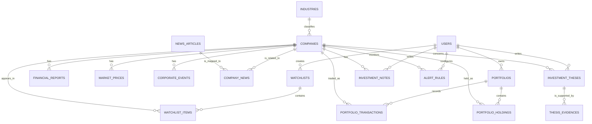

# 1차 프로젝트 초안: Stock Compass

## 1. 프로젝트 주제

**Stock Compass**는 개인 투자자가 관심 기업의 재무 정보, 가격 흐름, 기업 이벤트, 관련 뉴스를 비교하고, 가상 포트폴리오와 투자 판단 근거를 관리할 수 있는 기업 투자 리서치 웹 서비스다.

사용자가 기업명 또는 종목 코드로 기업을 찾으면 해당 기업의 핵심 정보와 경쟁사를 살펴볼 수 있다. 사용자는 기업을 관심목록에 저장하고, 가상 매수·매도 기록, 메모, 투자 가설을 남긴다. 이후 실적 발표나 주가 변화 같은 결과와 자신의 가설을 비교할 수 있다.

> 본 서비스는 투자 자문이나 매매 추천 서비스가 아니다. 사용자가 정보와 자신의 판단 근거를 체계적으로 관리하도록 돕는 학습·의사결정 지원 도구다.

## 2. 해결하려는 문제

개인 투자자는 기업 재무, 뉴스, 실적 일정, 보유 기록을 서로 다른 사이트와 메모 앱에서 관리하는 경우가 많다. 이때 다음 문제가 생긴다.

- 관심 기업을 어떤 이유로 저장했는지 시간이 지나면 알기 어렵다.
- 동일 산업의 경쟁사를 같은 기준으로 비교하기 어렵다.
- 매수·매도 당시의 판단과 실제 결과를 되돌아보기 어렵다.
- 기업별 일정(실적 발표, 배당, 공시)을 놓치기 쉽다.

Stock Compass는 기업 데이터, 사용자 기록, 가상 거래, 이벤트를 연결해 이 과정을 한 서비스 안에서 관리한다.

## 3. 주요 사용자

| 사용자 | 상황 | 필요 |
| --- | --- | --- |
| 투자 입문자 | 관심 기업은 있지만 무엇을 비교해야 할지 모름 | 핵심 지표와 경쟁사 비교, 이해하기 쉬운 요약 |
| 개인 투자자 | 여러 기업을 장기적으로 추적함 | 관심목록, 일정 알림, 투자 메모, 수익률 확인 |
| 투자 학습자 | 자신의 판단이 맞았는지 복기하고 싶음 | 투자 가설과 근거·결과 기록 |

1차 구현 범위에서는 일반 개인 투자자를 대표 사용자로 설정한다.

## 4. 비즈니스 모델

초기 서비스는 무료 개인 투자 리서치 도구로 제공한다. 프로젝트 구현의 중심은 수익화가 아니라 사용자 데이터와 기업 데이터가 연결되는 업무 흐름이다.

향후 확장 가능성은 다음과 같다.

- 무료: 기업 검색, 관심목록, 기본 비교, 가상 포트폴리오
- 프리미엄: 관심기업 수 제한 해제, 고급 비교 화면, 맞춤 알림, AI 리서치 요약
- B2B/교육: 투자 교육 과정에서 가상 포트폴리오와 투자 복기 기능 제공

## 5. 핵심 기능

### 5.1 기업 탐색과 비교

- 기업명·종목 코드·산업으로 기업을 검색한다.
- 기업 상세 화면에서 산업, 재무 요약, 가격 이력, 최근 뉴스, 기업 이벤트를 확인한다.
- 같은 산업에 속한 경쟁 기업을 선택해 매출, 영업이익률, PER/PBR 등으로 비교한다.

### 5.2 관심기업과 알림 관리

- 사용자는 여러 개의 관심목록을 만들고 기업을 저장한다.
- 관심 이유, 태그, 목표 가격, 메모를 기록한다.
- 실적 발표·배당·가격 조건 등 기업 관련 이벤트 알림을 설정한다.

### 5.3 가상 포트폴리오와 거래 기록

- 사용자는 가상 포트폴리오를 만들고 가상 매수·매도 거래를 등록한다.
- 거래내역을 기준으로 보유 수량, 평균 매입가, 평가금액, 수익률을 계산한다.
- 실제 금전 거래는 처리하지 않는다.

### 5.4 투자 가설 검증

- 사용자는 특정 기업에 대해 투자 가설과 근거를 구조화해 기록한다.
- 예: “신제품 출시로 다음 분기 매출이 증가할 것이다.”
- 실적 발표나 주가 변동 후, 가설의 결과와 회고를 저장한다.
- 일반 메모와 달리 가설은 상태(작성·검증 중·검증 완료)와 평가 결과를 갖는다.

### 5.5 AI 보조 요약

- 생성형 AI는 저장된 기업 지표·뉴스·이벤트를 읽기 쉬운 요약으로 정리한다.
- AI의 답변은 데이터베이스를 대체하지 않으며, 원본 정보 및 기준일을 함께 보여준다.

## 6. 핵심 사용자 흐름

```text
기업 검색
  → 기업 상세 정보 확인
  → 경쟁사 비교
  → 관심목록에 저장 및 관심 이유 기록
  → 가상 매수 또는 투자 가설 작성
  → 실적/배당/가격 이벤트 확인
  → 결과와 기존 판단을 복기
```

## 7. 초기 예상 화면

| 화면 | 핵심 내용 |
| --- | --- |
| 홈/대시보드 | 관심기업 현황, 다가오는 이벤트, 포트폴리오 요약 |
| 기업 검색 | 기업명·종목 코드·산업 검색 및 필터 |
| 기업 상세 | 기본 정보, 재무, 가격, 뉴스, 이벤트, 메모 |
| 경쟁사 비교 | 같은 산업 기업의 지표 비교 및 정렬 |
| 관심목록 | 목록별 기업, 관심 사유, 목표 가격, 태그 |
| 가상 포트폴리오 | 보유 종목, 수익률, 거래내역 등록·수정·삭제 |
| 투자 가설 노트 | 가설, 근거, 상태, 사후 평가 관리 |

## 8. 예상 데이터 구조

아래는 1차 기획 기준의 초기 엔터티다. 2차에서 화면과 요구사항을 확정한 뒤 ERD와 컬럼을 구체화하고, 3차에서 정규화와 제약조건을 검토해 최종 확정한다.

| 엔터티 | 필요한 이유 | 주요 관계 |
| --- | --- | --- |
| `users` | 사용자별 관심기업·포트폴리오·메모를 분리 | 관심목록, 포트폴리오, 가설, 알림과 1:N |
| `industries` | 산업 이름 중복을 막고 산업별 비교를 지원 | 기업과 1:N |
| `companies` | 검색·비교·거래의 기준이 되는 상장 기업 | 재무/가격/이벤트와 1:N |
| `financial_reports` | 기업별 기간별 매출·영업이익·순이익 등 재무 원천값 관리 | 기업과 1:N |
| `market_prices` | 일자별 종가·거래량 등 가격 이력 관리 | 기업과 1:N |
| `corporate_events` | 실적 발표, 배당, 공시 등 일정성 정보 관리 | 기업과 1:N |
| `news_articles` | 기사 자체의 제목·원문 URL·발행일을 한 번만 저장 | 기업과 N:M |
| `company_news` | 하나의 뉴스가 여러 기업과 관련될 수 있는 N:M 관계 해소 | 기업·뉴스의 연결 테이블 |
| `watchlists` | 사용자가 목적별로 관심기업 묶음을 만들 수 있게 함 | 사용자와 1:N |
| `watchlist_items` | 하나의 관심목록에 여러 기업을 저장하는 N:M 관계 해소 | 관심목록·기업의 연결 테이블 |
| `portfolios` | 사용자별로 여러 투자 전략/가상 계좌를 관리 | 사용자와 1:N |
| `portfolio_transactions` | 가상 매수·매도 이력을 변경 불가능한 거래 단위로 기록 | 포트폴리오·기업과 N:1 |
| `portfolio_holdings` | 현재 보유 수량·평균 매입가를 빠르게 조회하고 거래 처리 결과를 보관 | 포트폴리오·기업의 연결 엔터티 |
| `investment_theses` | 기업에 대한 구조화된 투자 가설과 검증 상태를 기록 | 사용자·기업과 N:1 |
| `thesis_evidences` | 가설의 근거를 뉴스·재무·사용자 입력 등 여러 형태로 연결 | 투자 가설과 1:N |
| `investment_notes` | 가설과 별개인 자유 형식 관찰·메모를 관리 | 사용자·기업과 N:1 |
| `alert_rules` | 사용자가 기업별 이벤트 또는 가격 조건 알림을 설정 | 사용자·기업과 N:1 |

예상 테이블 수는 17개이며, 각 테이블은 검색·비교·기록·거래·알림이라는 실제 업무 기능에 사용된다. 단순히 개수를 맞추기 위한 테이블은 만들지 않는다.

### 초기 관계 개요



## 9. 데이터베이스 수업 개념 적용 계획

| 개념 | 적용 계획 |
| --- | --- |
| PK/FK | 모든 엔터티에 대리키 PK를 두고, 관계는 FK로 보장 |
| 1:N | 산업-기업, 기업-가격, 사용자-포트폴리오, 포트폴리오-거래 |
| N:M | 기업-뉴스, 관심목록-기업을 연결 테이블로 해소 |
| 정규화 | 산업명·뉴스 원문·기업 기본정보의 중복 저장 방지 |
| CRUD | 관심목록, 거래, 메모, 가설, 알림을 생성·조회·수정·삭제 |
| JOIN | 관심목록별 기업·산업·최근 가격, 포트폴리오·거래·기업 정보 결합 |
| 집계 | 포트폴리오별 평가금액·수익률, 산업별 평균 지표, 이벤트 수 집계 |
| 서브쿼리 | 산업 평균보다 성장률이 높은 기업, 관심기업 중 미보유 기업 검색 |
| 인덱스 | 기업 검색 키, 기업별 가격 날짜, 기업별 재무 기간, 거래일 검색 |
| 트랜잭션 | 가상 거래 등록과 보유 수량·평균 매입가 갱신을 하나의 작업으로 처리 |

## 10. 데이터 확보 계획

- **시연용 샘플 데이터:** 국내 상장 기업 약 20~30개, 산업 5개, 분기 재무 데이터 3년치, 일별 또는 주별 가격 데이터, 뉴스·이벤트 데이터를 직접 구성한다.
- **확장 데이터:** 공개 금융 정보 또는 허용된 API를 통해 가격·공시·뉴스를 가져오는 방식을 검토한다.
- **기준일 관리:** 가격·재무·뉴스는 수집 기준일과 출처를 저장해 데이터의 시점을 설명할 수 있게 한다.

실시간 데이터 연동이 불안정하더라도, 시연과 SQL 검증에는 샘플 데이터가 사용되므로 핵심 기능이 중단되지 않는다.

## 11. 단계별 구현 계획

| 단계 | 목표 | 주요 산출물 |
| --- | --- | --- |
| 1차 | 문제와 서비스 범위 정의 | 기획서, 예상 엔터티, 발표 구성, 예상 Q&A |
| 2차 | 요구사항과 사용자 흐름 구체화 | 화면 설계, 기능 명세, ERD 초안, 변경 이력 |
| 3차 | DB 설계 확정 및 SQL 검증 | 최종 ERD, 테이블 명세, DDL, 시드 데이터, 주요 SQL |
| 4차 | 실제 서비스 구현 및 시연 | DB 연동 웹앱, CRUD, 검색·비교·통계, 실행 방법, 최종 발표 자료 |

## 12. 1차에서 의도적으로 제외한 범위

- 실제 증권 계좌 연동 및 실제 주문 실행
- 매수·매도 추천 또는 수익 보장
- 모든 상장사의 실시간 데이터 완전 수집
- 사용자 간 커뮤니티 및 유료 결제 기능

이 범위는 개인정보·금융 규제·외부 API 안정성 문제를 줄이고, 이번 프로젝트의 핵심인 관계형 데이터베이스 설계와 실제 CRUD 구현에 집중하기 위한 결정이다.

## 13. 발표에서 강조할 한 문장

**“Stock Compass는 기업 정보를 단순 조회하는 서비스가 아니라, 기업 데이터와 사용자의 관심·거래·판단 근거를 연결해 투자 의사결정 과정을 관리하는 관계형 데이터베이스 기반 서비스입니다.”**
